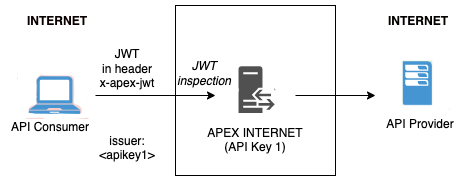

# JWT Flow Diagram

The following are the flow diagram for the different scenarios:

## Bridging Cross-Zone APIs from Intranet

## Bridging Cross-Zone APIs from Internet

## Single Zone APIs from Intranet

## Single Zone APIs from Internet

